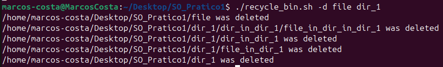
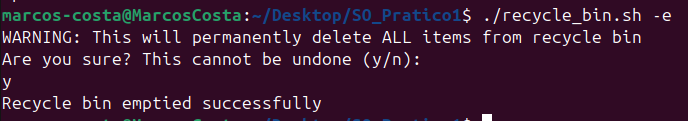
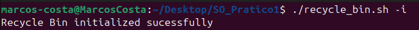
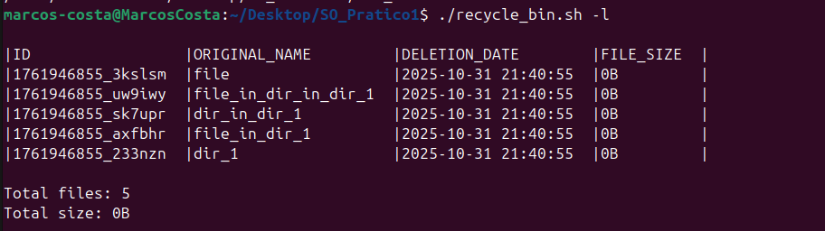
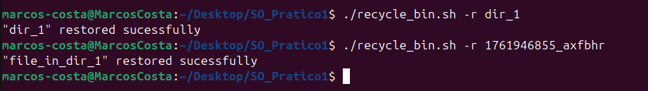
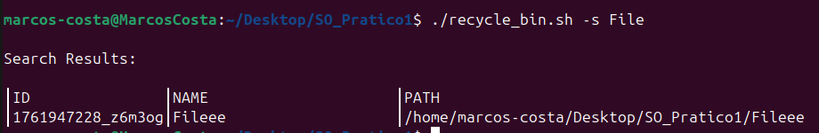

# Linux Recycle Bin System

**Student Name:** Marcos Costa, José Mendes  
**Student ID:** 125882, 114429 

## Description
This is a recycle bin system for linux based systems. It includes, among other features, file deletion/restauration, and recycle bin's content listing/searching/emptying.
## Installation
To setup the recycle bin system run "./recycle_bin.sh -i" or "./recycle_bin.sh initialize_recyclebin" in your terminal to setup the recycle bin in your current user's home directory.
## Usage
If no parameters are provided to recycle_bin the script will simply inform the user that it didn't recognize the operation requested. 

### Deleting files:

./recycle_bin.sh -d [FILES]
 **-example:** ./recycle_bin.sh -d file.txt ./recycle_bin.sh -d file.txt file2.txt ./recycle_bin.sh -d directory_to_delete 

### Listing Bin:

./recycle_bin.sh -l [--FLAG] 
**-example:** ./recycle_bin.sh -l ./recycle_bin.sh -l --detailed 

 For a lot of the following features you might need to use the file's ID which can be consulted with the feature above. 

### Restoring files:

./recycle_bin.sh -r [ID]|[FILENAME] 
**-example:** ./recycle_bin.sh -r 1234567890_abcdef ./recycle_bin.sh -r file_to_restore.txt ./recycle_bin.sh -r 1234567890_abcdef file_in_bin.txt 

### Searching Bin:

./recycle_bin.sh -s [-FLAG] [PATTERN] 
**-example:** ./recycle_bin.sh -s ^[a-z]{4} ./recycle_bin.sh -s string_to_match ./recycle_bin.sh -s -c string_case_insensitive 

### Clear Bin:

./recycle_bin.sh -e [--FLAG] [ID] 
**-example:** ./recycle_bin.sh -e ./recycle_bin.sh -e --force ./recycle_bin.sh -e 1234567890_abcdef ./recycle_bin.sh -e --force 1234567890_abcdef 

### Help:

./recycle_bin.sh [-flag] 
**-example:** ./recycle_bin.sh -h ./recycle_bin.sh --help ./recycle_bin.sh help

## Features
### Mandatory features

    • initialize_recyclebin 
    • delete_file 
    • list_recycled 
    • empty_recyclebin 
    • restore_file 
    • search_recycled  
    • display_help

 

### Optional features

    • show_statistics 
    • auto_cleanup 
    • check_quota 
    • preview_file

## Configuration
To configure settings such as maximum mb size of bin or the retention days for auto cleanup, access "$HOME/.recycle_bin/config" and alter said fields.
## Examples

### Delete Files

### Empty Recycle

### Initialize Bin

### List Files

### Restore Files

### Search File

## Known Issues
1. **Space Handling:** Minor issues with filenames containing spaces
2. **Concurrency:** No locking mechanism for simultaneous operations
3. **Date Arithmetic:** Simplified date comparison in auto-cleanup
4. **Long Output** In some cases (most commonly with detailed lists), columns can appear deformed if the output is too long for the window width.
## References
[\[How to output neat columns regardless of variable size\]](https://stackoverflow.com/questions/6462894/how-can-i-format-the-output-of-a-bash-command-in-neat-columns)  
[\[Custom field separator for command column\]](https://stackoverflow.com/questions/14218470/specific-a-delimiter-to-separate-data-into-columns)  
[\[numfmt for byte conversion\]](https://askubuntu.com/questions/1463041/convert-byte-value-to-mb-in-bash-script) 
[\[Split line into array using read and custom IFS\]](https://stackoverflow.com/questions/10586153/how-to-split-a-string-into-an-array-in-bash) 
[\[Case insensitive string comparing\]](https://stackoverflow.com/questions/1728683/case-insensitive-comparison-of-strings-in-shell-script)
